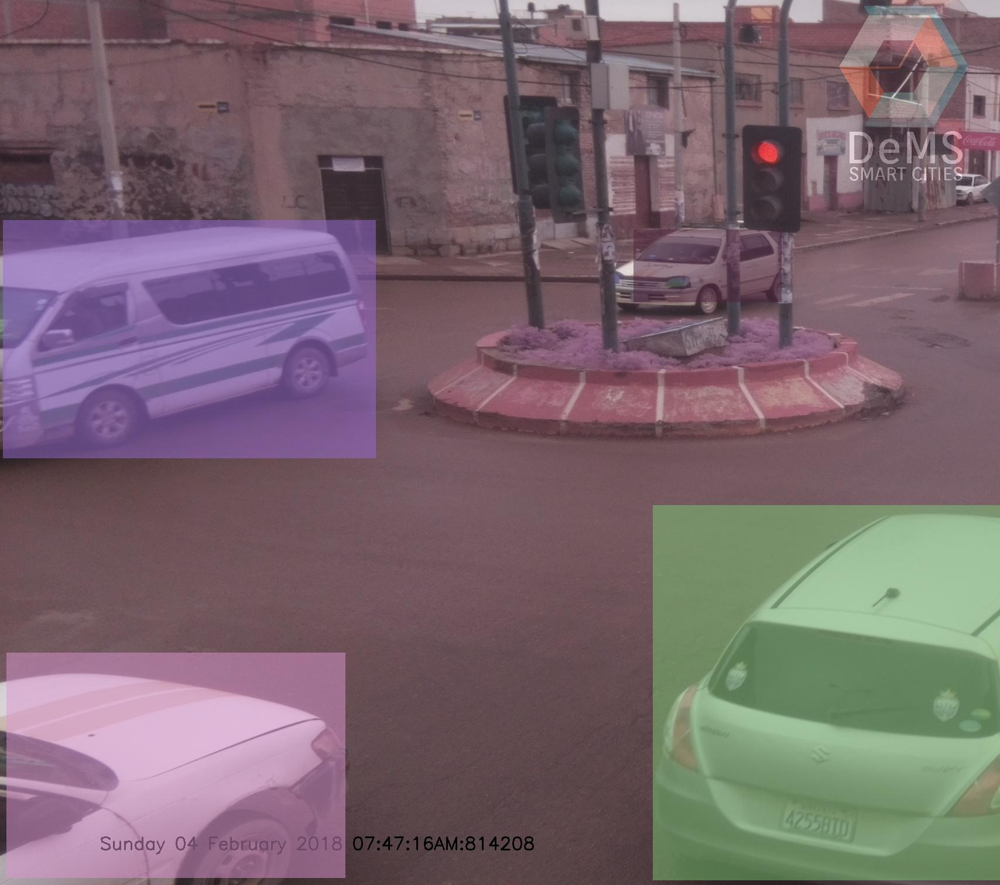

# Object Detection with MobileNetsv2

This is a implementation of [MobileNetsv2](https://arxiv.org/abs/1703.06870) for detecting Cars  & Trained Weights Using Tensorflow. It is written in Python and powered by TensorFlow deep learning framework.


<div align="center">
  
  <p>Example Mask R-CNN output.</p>
</div>

## Introduction

The goal of this repo is to provide a fast interface to the object detection API from Tensorflow based on MobileNetsv2, This also can be run on a RaspberryPi 


## License

This object detection interface is released under the [Apache 2.0 license](https://github.com/facebookresearch/detectron/blob/master/LICENSE). 


## Requirement
- Python 3.5
- TensorFlow >= 1.4
- OpenCV 3.3

## Usage

From the repository's root directory:(for example)

``` bash
$  python main.py -f test/2018-02-04_07-47-16.jpg
```
with the output: 

``` bash
$  {'detections': [{'class': 'car', 'coord': (641, 782, 5, 376), 'area': 258216, 'centroid': (325, 767), 'prob': 0.83862674}, {'class': 'car', 'coord': (1708, 1503, 1115, 863), 'area': 379520, 'centroid': (1969, 1614), 'prob': 0.8086516}, {'class': 'car', 'coord': (589, 1499, 11, 1115), 'area': 221952, 'centroid': (305, 1864), 'prob': 0.44606826}, {'class': 'car', 'coord': (1334, 515, 1082, 392), 'area': 30996, 'centroid': (1749, 649), 'prob': 0.4309835}], 'original_image': 'test/2018-02-04_07-47-16.jpg'}

```
which is a dictionary with the information of the detection in the target image.


## References

- [Mobilenet V2(Inverted Residual) Implementation & Trained Weights Using Tensorflow ](https://github.com/ildoonet/tf-mobilenet-v2).
- [Inverted Residuals and Linear Bottlenecks: Mobile Networks for Classification, Detection and Segmentation](https://arxiv.org/abs/1801.04381)
- [Paper Review (Korean)](http://openresearch.ai/t/mobilenetv2-inverted-residuals-and-linear-bottlenecks-mobile-networks-for-classification-detection-and-segmentation/130/1)
- [Mobilenet V2 Tensorflow Implementation : https://github.com/timctho/mobilenet-v2-tensorflow](https://github.com/timctho/mobilenet-v2-tensorflow)
- [Mobilenet V2 Pytorch Implementation : https://github.com/MG2033/MobileNet-V2](https://github.com/MG2033/MobileNet-V2)
- [Mobilenet V1 Official Implementation](https://github.com/tensorflow/models/blob/master/research/slim/nets/mobilenet_v1.py)
- [Mobilenet V1 Official Test](https://github.com/tensorflow/models/blob/master/research/slim/nets/mobilenet_v1_test.py)
- [Checkmate : Tensorflow Drop-in Saver](https://github.com/vonclites/checkmate)


